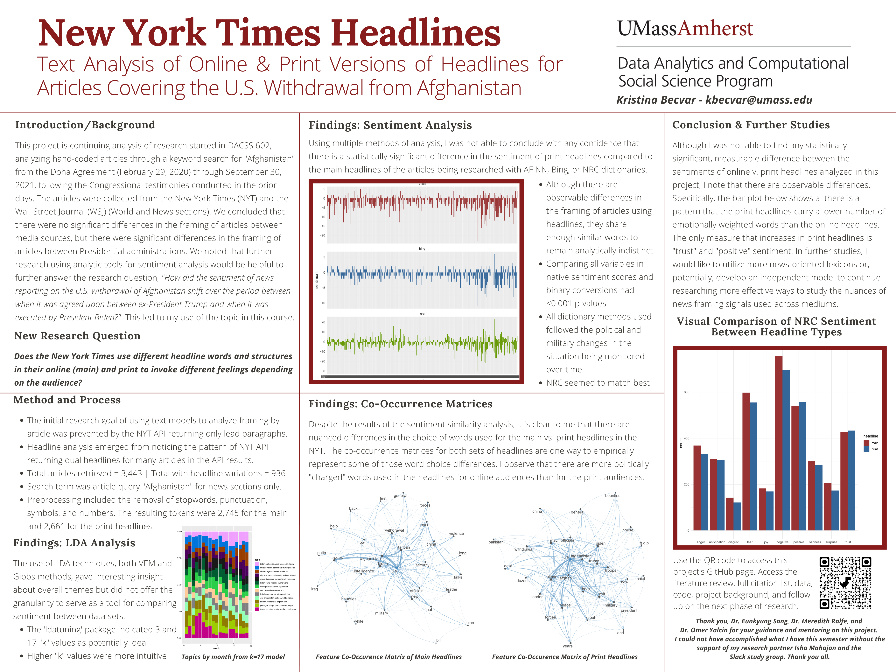

```{r setup, include=FALSE}
knitr::opts_chunk$set(echo = FALSE)
```

# Research Poster

This poster is a summary of this phase of research as presented as the Spring 2022 DACSS poster session. I look forward to continuing this research path in future semseters.



